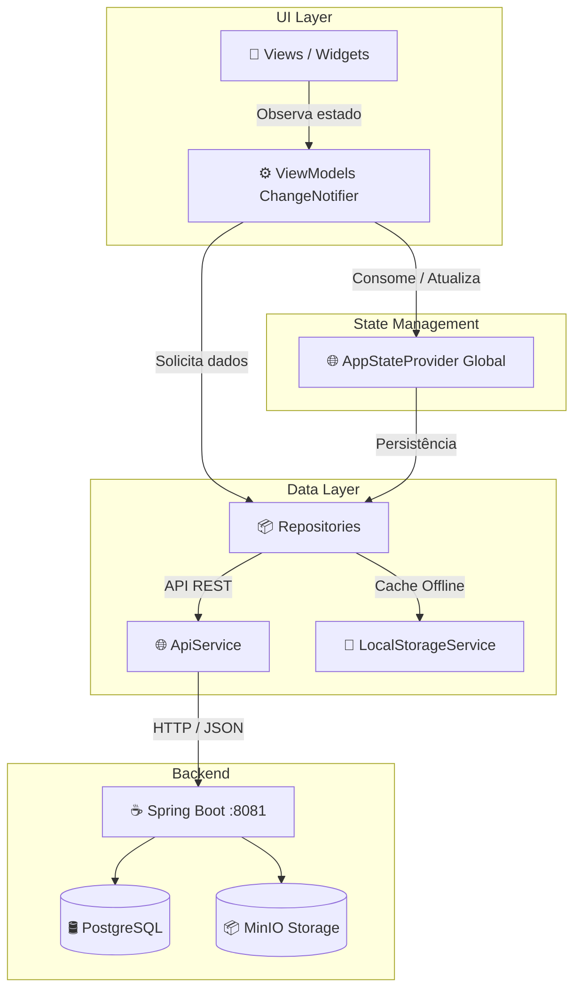

# 🤟 InteraLibras - Plataforma Gamificada de Aprendizado de Libras

[](https://flutter.dev)
[](https://flutter.dev)
[](https://spring.io)
[](https://www.postgresql.org)
[](https://min.io)
[](https://www.docker.com)
[](https://flutter.dev)

> 🎓 **Projeto de Iniciação Científica (IC)**
> 
> Este repositório é fruto de uma pesquisa de Iniciação Científica (IC) dedicada ao aperfeiçoamento, modernização e expansão da plataforma educativa desenvolvida originalmente como **Trabalho de Conclusão de Curso (TCC)** por **Luan Finatto**.
> 
> 🔗 Repositório de referência do TCC original: [finattttto/TCC](https://github.com/finattttto/TCC)

---

## 📌 Sobre o Projeto

O **InteraLibras** é uma plataforma educacional inclusiva e gamificada desenvolvida para auxiliar o ensino e a prática da Língua Brasileira de Sinais (Libras) para crianças e estudantes surdos ou ouvintes.

---

## 🎮 Funcionalidades Principais

### 1. Hub de Jogos Pedagógicos
- 🔤 **Alfabeto Manual**: Exploração e prática dos sinais dactilológicos das letras de A a Z e Ç.
- 🧠 **Jogo da Memória**: Associação visual e memorização entre letras e seus respectivos sinais.
- 🔍 **Jogo de Adivinhação**: Montagem de palavras em Libras com card responsivo, slots dinâmicos, suporte a mouse/trackpad e feedback do mascote.
- 📖 **Jogo de Palavras**: Associação de imagens reais às palavras corretas com alternativas dinâmicas e balanceamento de distratores.

### 2. Níveis de Dificuldade & Gamificação
- Níveis **Fácil** (com dicas), **Médio** e **Difícil** (sem dicas) sincronizados perfeitamente em toda a aplicação.
- Rastreamento isolado de conclusão e percentual de aproveitamento que inicia em 0% e progride com as atividades concluídas.
- Diálogo animado de celebração com confetes ao atingir 100% de conclusão de cada módulo.

### 3. Autenticação Inclusiva & Gestão de Usuários
- 👶 **Cadastro Infantil Simplificado**: Apenas com o primeiro nome da criança, gerando automaticamente um identificador único (`USER_ID`) e avatar aleatório, sem exigir e-mail ou dados complexos.
- 🕹️ **Modo Convidado**: Permite que crianças joguem imediatamente sem necessidade de cadastro, mantendo o progresso salvo localmente.
- 👤 **Modal de Perfil**: Permite alteração de nome, escolha de avatar visual e alteração de credenciais (com logout de segurança imediato caso usuário ou senha sejam modificados).
- 🔑 **Reset de Senhas no Painel Admin**: Administradores podem redefinir a senha de qualquer aluno, gerando uma senha temporária alfanumérica de 6 dígitos que exige a criação de uma nova senha definitiva no primeiro login (`mustChangePassword`).

### 4. Área do Professor / Painel Administrativo
- 🔒 **Acesso Exclusivo**: Restrito a usuários com perfil de Administrador (`ADMIN`).
- 🖥️ **Barreira de Viewport (< 720px)**: Bloqueio amigável de telas menores com aviso informativo para acesso via computadores ou tablets.
- 🏛️ **Interface Centralizada**: Abas da barra superior e título (*Área do Professor*) perfeitamente centralizados para melhor ergonomia visual em monitores amplos.
- 👥 **Gestão de Usuários**: Listagem, busca em tempo real por nome/username/ID e redefinição de senhas.
- 📝 **Criação de Atividades**: Wizard para criação de novos temas e inclusão de itens com upload de imagens.

---

## 🏗️ Padrão Arquitetural MVVM

O frontend Flutter foi completamente refatorado seguindo o padrão **MVVM (Model-View-ViewModel)** com separação estrita de responsabilidades:



### Divisão das Camadas:
1. **Views (`lib/ui/features/.../views`)**: Telas puras, declarativas e desacopladas, responsáveis exclusivamente pela renderização dos componentes e eventos do usuário.
2. **ViewModels (`lib/ui/features/.../view_models`)**: Classes `ChangeNotifier` contendo a lógica de negócios local de cada jogo ou tela, expondo estados reativos via `Provider`.
3. **Repositories (`lib/data/repositories`)**: Abstração da fonte de dados (`AuthRepository`, `AtividadeRepository`, `PersonagemRepository`, `PontuacaoRepository`), decidindo entre consumo da API remota ou do armazenamento local.
4. **Services (`lib/data/services`)**: Comunicação HTTP com o backend (`ApiService`) e persistência segura (`LocalStorageService`).
5. **State Global (`lib/state/app_state_provider.dart`)**: Gerenciador de estado global da aplicação que sincroniza o usuário ativo, pontuações e configurações.

---

## 🧪 Testes Automatizados

O projeto conta com suíte de testes unitários automatizados cobrindo fluxos essenciais de autenticação, persistência, ViewModels e normalização de textos:

```bash
cd flutter_client
flutter test
```
> ✅ **26/26 testes passando com 100% de sucesso**.

---

## 💻 Como Rodar o Projeto Localmente

### 1️⃣ Clonar o Repositório
```bash
git clone https://github.com/ValberSales/IC-Flutter.git
cd IC-Flutter
```

---

### 2️⃣ Iniciar o Banco de Dados e Storage (Docker)
Certifique-se de que o **Docker Desktop** está em execução:
```bash
docker compose up -d
```
> Containers iniciados:
> - 🛢️ **PostgreSQL 15** na porta `5432`
> - 📦 **MinIO Storage** na porta `9000` (Console Admin na porta `9001`)

---

### 3️⃣ Iniciar o Servidor Backend (Spring Boot Java)
```bash
cd server_java
mvn clean spring-boot:run
```
> ℹ️ Servidor online em `http://localhost:8081`.

---

### 4️⃣ Iniciar a Aplicação Client (Flutter)
```bash
cd flutter_client
flutter pub get
flutter run -d chrome
```

---

## 🔑 Credenciais Padrão de Acesso

| Perfil | Usuário / Login | Senha |
| :--- | :--- | :--- |
| **Administrador / Professor** | `admin` | `123456` |

---

## 🤝 Créditos e Agradecimentos

- **Luan Finatto**: Criador do projeto de TCC original ([Repositório finattttto/TCC](https://github.com/finattttto/TCC)).
- **Equipe de Iniciação Científica (IC)**: Responsável pela modernização arquitetural, implementação do padrão MVVM, expansão pedagógica e novas funcionalidades.

---

## 📄 Licença

Este projeto é desenvolvido para fins acadêmicos e educacionais sem fins lucrativos.
