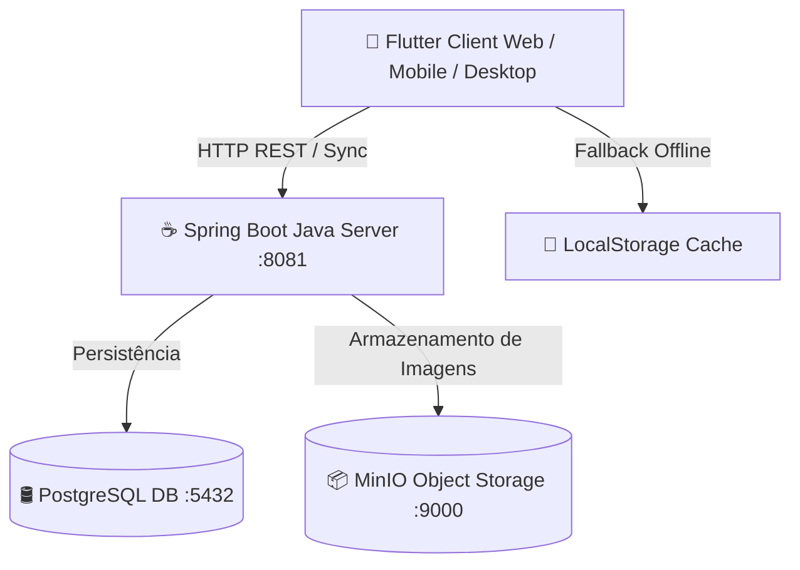

# 🤟 InteraLibras - Plataforma Gamificada de Aprendizado de Libras

[](https://flutter.dev)
[](https://spring.io)
[](https://www.postgresql.org)
[](https://min.io)
[](https://www.docker.com)

> 🎓 **Projeto de Iniciação Científica (IC)**
> 
> Este repositório é fruto de uma pesquisa de Iniciação Científica (IC) dedicada ao aperfeiçoamento, modernização e expansão da plataforma educativa desenvolvida originalmente como **Trabalho de Conclusão de Curso (TCC)** por **Luan Finatto**.
> 
> 🔗 Repositório de referência do TCC original: [finattttto/TCC](https://github.com/finattttto/TCC)

---

## 📌 Sobre o Projeto

O **InteraLibras** é uma plataforma educacional inclusiva e gamificada desenvolvida para auxiliar o ensino e a prática da Língua Brasileira de Sinais (Libras). O sistema conta com:

- 🎮 **Hub com 4 Jogos Pedagógicos Interativos**:
  - **Alfabeto Manual**: Identificação dos sinais dactilológicos do alfabeto em Libras.
  - **Jogo da Memória**: Associação visual entre letras e sinais.
  - **Jogo de Adivinhação**: Formação livre de palavras selecionando os sinais de Libras correspondentes.
  - **Jogo de Palavras**: Associação de imagens reais às palavras corretas com múltiplas alternativas adaptativas.
- 🌟 **Progresso & Níveis de Dificuldade Adaptativos**:
  - Níveis **Fácil**, **Médio** e **Difícil** configurados de forma autônoma para cada jogo.
  - Rastreamento isolado de conclusão e percentual de acertos por nível e tema.
  - Diálogo animado de comemoração ao atingir 100% de conclusão de cada módulo.
- 👩‍🏫 **Área do Professor**:
  - Gestão de temas e criação de atividades dinâmicas e inclusivas para turmas.
- ⚡ **Suporte Offline & Sincronização Inteligente**:
  - Persistência local com sincronização automática com o backend PostgreSQL quando online.

---

## 🛠️ Arquitetura do Sistema



---

## 🚀 Como Instalar o Flutter

Antes de rodar a aplicação client, é necessário ter o **Flutter SDK** instalado no seu sistema operacional.

### 🪟 Windows

1. Baixe o pacote de instalação do Flutter SDK no site oficial: [flutter.dev/docs/get-started/install/windows](https://docs.flutter.dev/get-started/install/windows).
2. Extraia o arquivo `.zip` na pasta desejada (ex: `C:\src\flutter`).
3. Adicione o caminho do executável às variáveis de ambiente do sistema:
   - Abra o menu iniciar e busque por **Variáveis de Ambiente**.
   - Em **Variáveis do usuário**, edite a variável `Path` e adicione `C:\src\flutter\bin`.
4. Abra o **Prompt de Comando** ou **PowerShell** e verifique a instalação:
   ```cmd
   flutter doctor
   ```

---

### 🍎 macOS

#### Opção 1: Via Homebrew (Recomendado)
```bash
brew install --cask flutter
```

#### Opção 2: Instalação Manual (Git)
1. Clone o repositório oficial do Flutter:
   ```bash
   git clone https://github.com/flutter/flutter.git -b stable ~/development/flutter
   ```
2. Adicione o Flutter ao seu arquivo de configuração de shell (`~/.zshrc` ou `~/.bash_profile`):
   ```bash
   export PATH="$PATH:$HOME/development/flutter/bin"
   ```
3. Atualize o ambiente do terminal e execute a verificação:
   ```bash
   source ~/.zshrc
   flutter doctor
   ```

---

### 🐧 Linux

#### Opção 1: Via Snap (Recomendado)
```bash
sudo snap install flutter --classic
```

#### Opção 2: Instalação Manual
1. Baixe o pacote `.tar.xz` ou clone do repositório:
   ```bash
   git clone https://github.com/flutter/flutter.git -b stable ~/flutter
   ```
2. Adicione ao arquivo `~/.bashrc`:
   ```bash
   export PATH="$PATH:$HOME/flutter/bin"
   ```
3. Execute no terminal:
   ```bash
   source ~/.bashrc
   flutter doctor
   ```

---

## 💻 Como Rodar o Projeto Localmente

Siga o passo a passo abaixo para executar toda a pilha do projeto na sua máquina.

### 1️⃣ Clonar o Repositório
```bash
git clone https://github.com/ValberSales/IC-Flutter.git
cd IC-Flutter
```

---

### 2️⃣ Iniciar o Banco de Dados e Storage (Docker)

Certifique-se de que o **Docker Desktop** está em execução na sua máquina.

Execute na raiz do projeto:
```bash
docker compose up -d
```
> Isso iniciará os containers:
> - 🛢️ **PostgreSQL 15** na porta `5432`
> - 📦 **MinIO Storage** na porta `9000` (Console Admin na porta `9001`)

---

### 3️⃣ Iniciar o Servidor Backend (Spring Boot Java)

Em uma nova aba do terminal, acesse a pasta `server_java` e execute:

```bash
cd server_java
mvn clean spring-boot:run
```
> ℹ️ O servidor estará online na porta `http://localhost:8081`.

---

### 4️⃣ Iniciar a Aplicação Client (Flutter)

Em outra aba do terminal, acesse a pasta `flutter_client`:

```bash
cd flutter_client

# Baixar as dependências do projeto
flutter pub get

# Executar no navegador Chrome (Web)
flutter run -d chrome
```

> 💡 **Opções de execução alternativas**:
> - Para rodar em Desktop (macOS/Windows/Linux): `flutter run -d macos` (ou `windows` / `linux`)
> - Para rodar em dispositivo/emulador móvel: `flutter run`

---

## 🔑 Credenciais Padrão de Acesso

Para acessar a **Área do Professor** durante os testes locais, utilize as credenciais de administrador prontas:

| Campo | Credencial |
| :--- | :--- |
| **Usuário / Login** | `admin` |
| **Senha** | `123456` |

---

## 🤝 Créditos e Agradecimentos

- **Luan Finatto**: Criador do projeto de TCC original ([Repositório finattttto/TCC](https://github.com/finattttto/TCC)).
- **Equipe de Iniciação Científica (IC)**: Responsável pela continuidade, ampliação da arquitetura e desenvolvimento das novas funcionalidades educacionais.

---

## 📄 Licença

Este projeto é desenvolvido para fins acadêmicos e educacionais sem fins lucrativos.
